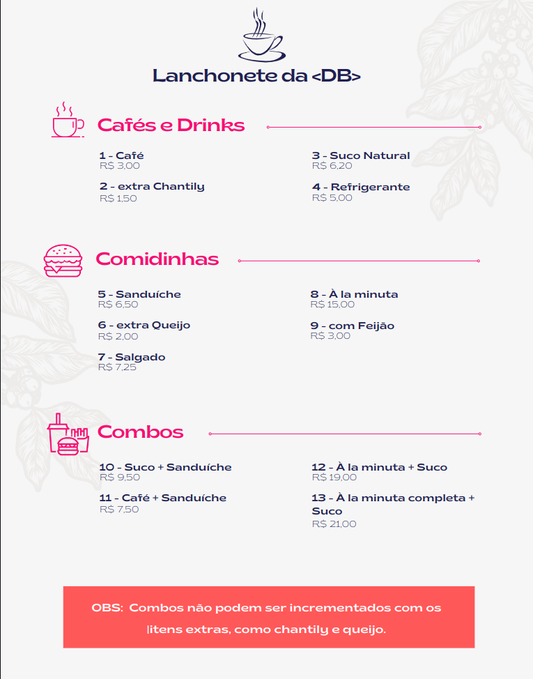

# Caixa da Lanchonete

Olá! Você foi contratado para automatizar o caixa da Lanchonete da DB.
Sua missão será construir um aplicativo de linha de comando (Console) que calcula o valor de uma compra de acordo com o cardápio, regras e descontos da Lanchonete.

 

## Cardápio

 

## Formas de pagamento
Atualmente a Lanchonete aceita as seguintes formas de pagamento:
 - dinheiro
 - debito
 - credito

O sistema deve receber essa informação como string, utilizando a grafia exatamente igual aos exemplos acima.

 

## Descontos e Taxas:
 - Pagamento em dinheiro tem 5% de desconto
 - Pagamento a crédito tem acréscimo de 3% no valor total

 

## Outras regras:
Caso item extra seja informado num pedido que não tenha o respectivo item principal, apresentar mensagem "Item extra não pode ser pedido sem o principal". Combos não são considerados como item principal.
É possível pedir mais de um item extra sem precisar de mais de um principal.

 

---

 

## Como rodar?
-- descrever estrutura do código e como rodar
